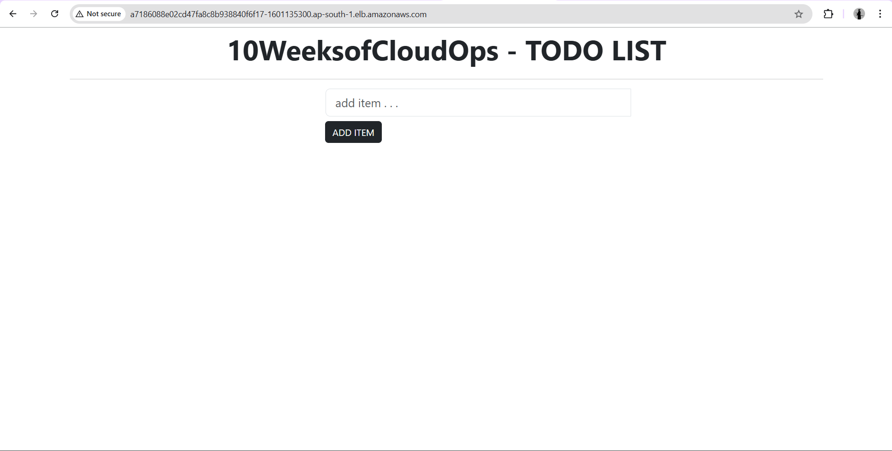
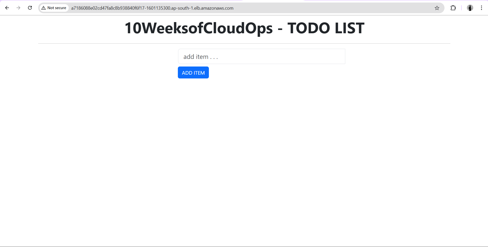
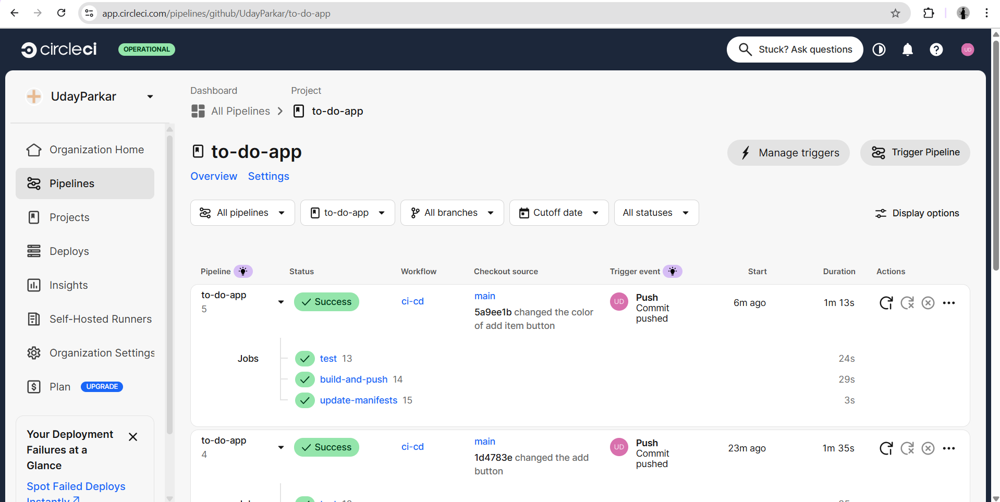
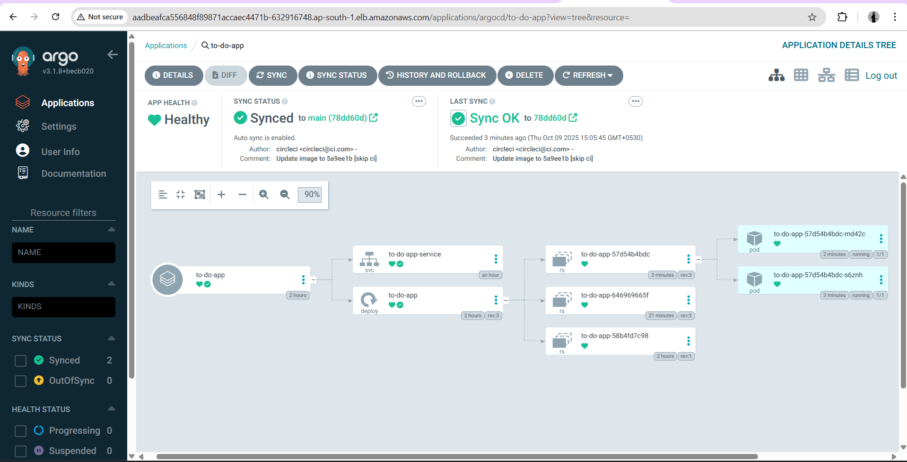

# Automating Deployment of a Dockerized ToDo App on AWS EKS Using GitOps and ArgoCD 

## 📌 Project Overview

This project demonstrates a **cloud-native DevOps workflow** for deploying a React-based To-Do application using modern practices:

- **Terraform** → Infrastructure as Code (VPC, EKS, IAM, EC2 worker nodes)  
- **CircleCI** → CI/CD pipeline for Docker build & push  
- **ArgoCD** → GitOps for Kubernetes sync and self-healing  
- **Ansible** → Infrastructure automation for ArgoCD setup via Helm  
- **Docker** → Containerized React app served via Nginx  

The result is a fully automated, scalable, and reliable workflow from **code → container → cluster → end-user**.

### Key Components:
- **AWS EKS Cluster**: Managed Kubernetes control plane
- **VPC & Subnets**: Secure network infrastructure with public/private subnets
- **CircleCI**: Automated CI/CD pipeline
- **ArgoCD**: GitOps continuous delivery tool (installed via Helm + Ansible)
- **Docker Hub**: Container registry for storing Docker images
- **Application Load Balancer**: Exposes the application to end users

---

## 📂 Project Structure

```
to-do-app/
├── .circleci/
│   └── config.yml                    # CircleCI pipeline configuration
├── infra/
│   ├── terraform/
│   │   ├── bootstrap-backend/        # S3 & DynamoDB backend for Terraform state
│   │   │   ├── main.tf               # Backend bucket & DynamoDB configuration
│   │   │   ├── variables.tf          # Backend variables
│   │   │   └── outputs.tf            # Backend outputs
│   │   └── eks-cluster/              # EKS, VPC, IAM provisioning
│   │       ├── main.tf               # Main Terraform configuration
│   │       ├── variables.tf          # Input variables
│   │       ├── outputs.tf            # Output values
│   │       ├── providers.tf          # Provider configuration
│   │       └── secrets.tfvars            # Sensitive data configuration
│   ├── argocd/
│   │   ├── argocd-app.yaml           # ArgoCD Application definition
│   │   └── values.yaml               # Simplified Helm configuration for ArgoCD
│   └── ansible/
│       ├── inventory.ini                  # Inventory for Ansible
│       ├── setup-argocd-helm.yml         # Playbook for ArgoCD installation via Helm
│       └── cleanup-argocd-helm.yml       # Playbook for ArgoCD cleanup
├── k8s/
│   ├── deployment.yaml               # Kubernetes Deployment
│   └── service.yaml                  # LoadBalancer Service (internet-facing)
├── images/                           # Screenshots and diagrams
│   ├── circleci-ui-new.png           # CircleCI pipeline output
│   ├── argocd-ui-new.png             # ArgoCD dashboard screenshot
│   ├── to-do-app-1.png               # To-Do App v1 (original version)
│   └── to-do-app-2.png               # To-Do App v2 (updated via CI/CD)
├── src/                              # React application source code
├── public/                           # Static assets
├── Dockerfile                        # Multi-stage Dockerfile for React + Nginx
├── package.json                      # Node.js dependencies
├── .dockerignore                     # Docker build exclusions
├── .gitignore                        # Git exclusions
└── README.md                         # Documentation
```

---

## ⚙️ Workflow

### End-to-End Pipeline:

1. **Infrastructure Provisioning (Terraform)**  
   - Creates VPC with public/private subnets across multiple AZs
   - Provisions EKS cluster with managed node group
   - Configures IAM roles and security groups
   - Sets up networking components (NAT Gateway, Internet Gateway)

2. **Continuous Integration (CircleCI)**  
   - Triggers on Git push to main branch
   - Runs linting and unit tests
   - Builds Docker image with versioned tag
   - Pushes image to Docker Hub
   - Updates Kubernetes manifests with new image tag
   - Commits changes back to GitHub repository

3. **Continuous Deployment (ArgoCD)**  
   - Monitors GitHub repository for manifest changes
   - Automatically syncs desired state to EKS cluster
   - Performs health checks on deployed resources
   - Provides self-healing capabilities
   - Enables easy rollback if needed

4. **Kubernetes Orchestration**  
   - Deploys pods running the To-Do application
   - Creates LoadBalancer service
   - Manages replicas and rolling updates
   - Handles pod scheduling and resource allocation

5. **User Access**  
   - Application accessible via AWS ELB DNS hostname
   - Traffic routed through AWS Load Balancer
   - High availability across multiple nodes

---

## 🛠️ Prerequisites

Before you begin, ensure you have the following installed:

- **AWS CLI** (v2.x or higher) - [Installation Guide](https://docs.aws.amazon.com/cli/latest/userguide/install-cliv2.html)
- **Terraform** (v1.5+) - [Download](https://www.terraform.io/downloads.html)
- **kubectl** (v1.28+) - [Installation Guide](https://kubernetes.io/docs/tasks/tools/)
- **Ansible** (v2.9+) - [Installation Guide](https://docs.ansible.com/ansible/latest/installation_guide/intro_installation.html)
- **Helm** (v3.x+) - [Installation Guide](https://helm.sh/docs/intro/install/)
- **Docker** (v20.x+) - [Get Docker](https://docs.docker.com/get-docker/)
- **Git** - [Installation](https://git-scm.com/downloads)

### Required Accounts:
- AWS Account with appropriate IAM permissions
- Docker Hub account
- GitHub account
- CircleCI account

---

## 🚀 Getting Started

### Step 1: Clone the Repository

```bash
git clone https://github.com/your-username/to-do-app.git
cd to-do-app
```

### Step 2: Configure AWS Credentials

```bash
aws configure
# Enter your AWS Access Key ID, Secret Access Key, and default region
```

### Step 3: Initialize Terraform Backend

```bash
cd infra/terraform/bootstrap-backend
terraform init
terraform apply
```

This creates S3 bucket and DynamoDB table for remote state management with locking.

### Step 4: Provision EKS Cluster

```bash
cd ../eks-cluster
terraform init
terraform apply -var-file="secrets.tfvars"
```

This will create:
- VPC with 3 public and 3 private subnets
- EKS cluster (control plane) in ap-south-1 region
- Managed node group with m7i-flex.large instances (2-3 nodes)
- Required security groups and IAM roles

### Step 5: Configure kubectl

```bash
aws eks update-kubeconfig --region <your-region> --name <cluster-name>
kubectl get nodes
```

### Step 6: GitOps Deployment (ArgoCD)

ArgoCD monitors the Git repo and syncs your Kubernetes manifests automatically.

**Install ArgoCD via Ansible Helm playbook:**

```bash
cd infra/ansible
ansible-playbook -i inventory.ini setup-argocd-helm.yml
```

This playbook will:
* Create the `argocd` namespace
* Install ArgoCD via Helm using custom values
* Deploy the To-Do app ArgoCD Application manifest
* Display the ArgoCD UI URL and admin credentials

**Access ArgoCD UI:**

The playbook output will provide:
* **UI URL**: `http://<LoadBalancer-DNS>` (from AWS ELB)
* **Username**: `admin`
* **Password**: Retrieved automatically from the secret

Alternatively, get the details manually:

```bash
# Get ArgoCD service URL
kubectl get svc -n argocd argocd-server

# Get admin password
kubectl get secret argocd-initial-admin-secret -n argocd -o jsonpath="{.data.password}" | base64 --decode
```

### Step 7: 🔁 Continuous Integration (CircleCI)

**Pipeline tasks:**
1. Run tests (`npm test`)
2. Build Docker image
3. Push image to DockerHub with commit SHA

**Configure CircleCI:**

1. Go to [CircleCI Dashboard](https://app.circleci.com/)
2. Connect your GitHub repository
3. Add environment variables:
   - `DOCKER_USERNAME`
   - `DOCKER_PASSWORD`
   - `GITHUB_TOKEN`
4. Trigger pipeline by pushing to main branch

### Step 8: Access the Application

```bash
kubectl get svc -n default
# Find the EXTERNAL-IP (AWS ELB DNS name)
```

Open browser: `http://<EXTERNAL-IP>`

---

## 📸 Verification & Screenshots

### 1. To-Do App Before Changes (v1)


**Original version deployed on EKS**

### 2. To-Do App After CI/CD Update (v2)


**Updated version automatically deployed via CircleCI & ArgoCD (e.g., button color change)**

### 3. CircleCI Pipeline  


**Expected Output:**
- ✅ Build job: Success
- ✅ Test job: All tests passed
- ✅ Docker build & push: Image uploaded to Docker Hub
- ✅ Update manifests: Committed to GitHub
- ✅ Pipeline runs on every push to main branch

### 4. ArgoCD UI (Application Synced & Healthy)  


**Status Indicators:**
- **Sync Status**: Synced ✅
- **Health Status**: Healthy ✅
- Real-time monitoring and auto-sync enabled

### 5. Terminal Verification  

**Check Nodes:**
```bash
kubectl get nodes

# Expected output:
NAME                           STATUS   ROLES    AGE   VERSION
ip-10-0-1-123.ec2.internal    Ready    <none>   1h    v1.28.x
ip-10-0-2-124.ec2.internal    Ready    <none>   1h    v1.28.x
```

**Check Pods:**
```bash
kubectl get pods -n default

# Expected output:
NAME                          READY   STATUS    RESTARTS   AGE
todo-app-5f6d8c9b7d-abc12    1/1     Running   0          10m
todo-app-5f6d8c9b7d-def34    1/1     Running   0          10m
```

**Check Service:**
```bash
kubectl get svc -n default

# Expected output:
NAME         TYPE           CLUSTER-IP       EXTERNAL-IP                                                               PORT(S)        AGE
todo-app     LoadBalancer   172.20.123.45    a1b2c3d4e5f6g7h8-1234567890.us-east-1.elb.amazonaws.com                 80:30123/TCP   10m
```

**Check ArgoCD Application:**
```bash
kubectl get application -n argocd

# Expected output:
NAME       SYNC STATUS   HEALTH STATUS
todo-app   Synced        Healthy
```

---

## 🔧 Configuration

### Environment Variables (CircleCI)

| Variable | Description | Example |
|----------|-------------|---------|
| `DOCKER_USERNAME` | Docker Hub username | `myusername` |
| `DOCKER_PASSWORD` | Docker Hub password or token | `dckr_pat_xxxxx` |
| `GITHUB_TOKEN` | GitHub Personal Access Token | `ghp_xxxxx` |

### Terraform Variables

Edit `infra/terraform/eks-cluster/terraform.tfvars`:

```hcl
region              = "ap-south-1"
cluster_name        = "todo-eks"
node_instance_type  = "m7i-flex.large"
desired_capacity    = 2
min_size            = 1
max_size            = 3
```

Create `infra/terraform/eks-cluster/secrets.tfvars` for sensitive credentials:

```hcl
aws_access_key = "YOUR_AWS_ACCESS_KEY"
aws_secret_key = "YOUR_AWS_SECRET_KEY"
eks_admin_arn  = "arn:aws:iam::YOUR_ACCOUNT_ID:user/YOUR_USERNAME"
```

⚠️ **Important**: Add `secrets.tfvars` to `.gitignore` to prevent committing credentials!

### Ansible Configuration

Edit `infra/ansible/inventory.ini`:

```ini
[local]
localhost ansible_connection=local
```

The playbook runs locally and connects to your configured Kubernetes cluster via kubectl context.

### Kubernetes Resources

**Deployment** (`k8s/deployment.yaml`):
- Replicas: 2 (configurable)
- Image: Updated automatically by CircleCI
- Resource limits: 500m CPU, 512Mi memory
- Rolling update strategy for zero-downtime deployments

**Service** (`k8s/service.yaml`):
- Type: LoadBalancer
- Port: 80
- Target Port: 80
- Internet-facing for end-user access

---

## 🔍 Monitoring & Troubleshooting

### Common Issues

**1. Pods not starting:**
```bash
kubectl describe pod <pod-name>
kubectl logs <pod-name>
```

**2. Service not getting external IP:**
```bash
kubectl describe svc todo-app
# Check AWS Load Balancer creation in AWS Console
```

**3. ArgoCD sync failing:**
```bash
kubectl logs -n argocd deployment/argocd-application-controller
```

**4. CircleCI build failing:**
- Check CircleCI dashboard for error logs
- Verify environment variables are set correctly
- Ensure Docker Hub credentials are valid

**5. Ansible playbook errors:**
```bash
# Run with verbose output
ansible-playbook -i inventory.ini setup-argocd-helm.yml -v

# Check Helm installation
helm list -n argocd
```

### Health Checks

```bash
# Check cluster health
kubectl cluster-info

# Check all resources
kubectl get all -n default

# Check ArgoCD status
kubectl get pods -n argocd

# Verify Helm installation
helm status argocd -n argocd
```

---

## 🧹 Cleanup

To avoid AWS charges, destroy all resources:

```bash
# Option 1: Use Ansible cleanup playbook (recommended)
cd infra/ansible
ansible-playbook -i inventory.ini cleanup-argocd.yml

# Delete Kubernetes resources
kubectl delete -f k8s/

# Destroy EKS cluster
cd ../terraform/eks-cluster
terraform destroy

# Destroy backend (optional)
cd ../bootstrap-backend
terraform destroy
```

⚠️ **Warning**: This will permanently delete all resources and data.

---

## 📚 Additional Resources

- [AWS EKS Documentation](https://docs.aws.amazon.com/eks/)
- [ArgoCD Documentation](https://argo-cd.readthedocs.io/)
- [CircleCI Documentation](https://circleci.com/docs/)
- [Kubernetes Documentation](https://kubernetes.io/docs/)
- [Terraform AWS Provider](https://registry.terraform.io/providers/hashicorp/aws/latest/docs)
- [Ansible Documentation](https://docs.ansible.com/)
- [Helm Documentation](https://helm.sh/docs/)

---

## 👨‍💻 Author

**Your Name**  
- GitHub: [@UdayParkar](https://github.com/UdayParkar)
- LinkedIn: [uday-parkar](https://linkedin.com/in/uday-parkar)
- Email: udayparkar2003@gmail.com